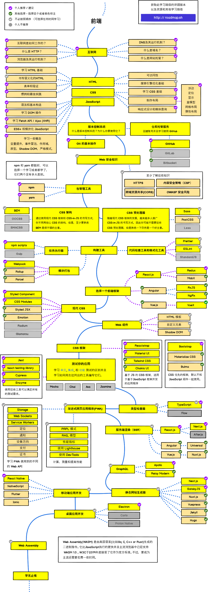

# Roadmap
> Roadmap of developer in 2020.

## Purpose 

`The purpose of these raedmaps is to give you an idea about the landspace and the guice if you are consused about what
to learn next and not to encourage you pick what is hip and trendy. You should grow some understanding of why one tool would
be better suited for some cases that the other and remember hip and trendy never means best suited for the job.`

## Frontend-map Roadmap

## Backend Roadmap

## DevOps Roadmap

## Contribution

- Open pull request with improvements
- Discuss ideas in issues
- Spread the word

## License

Have a look at the [license file](./LICENSE) for details.